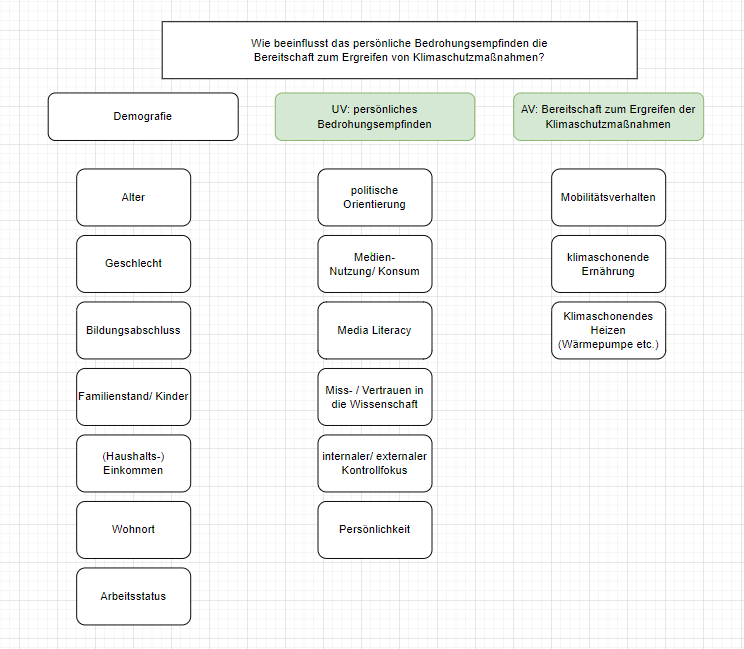

```{r setup, include=FALSE}
knitr::opts_chunk$set(echo = TRUE)
```

# Verhaltensänderung beim Klimawandel

## Teammitglieder
* LC
* SP
* ZNB

# Forschungsfrage
Wie beeinflusst das **persönliche Bedrohungsempfinden** die **Bereitschaft zum Ergreifen** von Klimaschutzmaßnahmen?

## Scopus-Recherche
Abstract-Info

## Faktorenraum



## Operationalisieren des Fragebogens/ der Items

### Demografie
* **Alter**  verhältnisskalierter Wert: Einfachantwort
* **Geschlecht**  nominaler Wert: Auswahlmöglichkeit  _m/w/d_
* **Bildungsabschluss**  nominaler Wert: Auswahlmöglichkeit  _Haupt- oder Realschulabschluss/ Ausbildung/ Meister/ (Fach-)Abitur/ Hochschulabschluss_
* **Familienstand/ Kinder**  nominaler Wert: Mehrfachauswahl  _ledig/ verheiratet/ 1 Kind/ 2 Kinder/ 3 Kinder/ mehr als 3 Kinder/ geschieden_  Begründung: durchschn. Kinder 1,5, also 3 max. Als deutscher durchschnitt vgl. Statistisches Bundesamt
* **Einkommen/Haushaltseinkommen**  intervall Wert: Mehrfachauswahl  _< 1000€, 1000-2000 €, 2000-3000€, 3000-4000€, 4000-5000€, > 5000€_
* **Wohnort**  nominaler Wert: Mehrfachauswahl  _Stadt/ Vorort/ Land_
* **Arbeitsstatus**  nominaler Wert: Mehrfachauswahl  _arbeitssuchend/ Arbeitnehmer/ Arbeitgeber/ selbstständig_

### Persönliches Bedrohungsempfinden: (latentes Merkmal/ Variable)
* **Politische Orientierung**  nominaler Wert: Item bestehend aus Rating/ Likert-Skala [5-stufig]  _Zustimmung/ Ablehnung von politischen Statements_ Bsp.: “Reiche sollten mehr besteuert werden”
* **Mediennutzung/–Konsum**  ordinal: verschiedene Items  _Item-Medienkonsum_ (Häufigkeit)  _Rangliste  Item-Medienkonsum_ -> Mehrfachantwort, Likert-Skala (mehrfach die Woche, einmal …)  _Klimainhalte-Konsum_ (Was wird genutzt?) Mehrfachantwort, Likert-Skala mit Statements Bsp.: “Ich konsumiere Inhalte zum Thema Klimawandel/ -Schutz”
* **Media Literacy**  Ordinal: Mehrfachantwort, Likert-Skala Statements -> orientiert an	[diesem Messinstrument/ Text](https://repositorio.ual.pt/bitstream/11144/3873/1/%5BCommunications%5D%20Measuring%20media%20and%20information%20literacy%20skills%20Construction%20of%20a%20test.pdf)
* **Miss-/ Vertrauen in die Wissenschaft**  ordinal: _Item mit 5-stufiger Likert-Skala_ orientiert an [diesem Messinstrument/ Text](https://www.wissenschaft-im-dialog.de/fileadmin/user_upload/Projekte/Wissenschaftsbarometer/Dokumente_22/Fragebogen_Wissenschaftsbarometer2022_CATI.pdf)
* **Internaler/externaler Kontrollfokus**  ordinaler Wert: _Kurzskala nach Kovaleva et al. 2012_  [siehe Hier](https://www.gesis.org/fileadmin/kurzskalen/working_papers/IE4_Workingpaper.pdf)
* **Persönlichkeit**  Item orientiert am Big 5 Test der [Uni Leipzig](https://leipzig-bfi2-60.formr.org/) oder [siehe Hier](https://zis.gesis.org/skala/Danner-Rammstedt-Bluemke-Lechner-Berres-Knopf-Soto-John-Die-deutsche-Version-des-Big-Five-Inventory-2-BFI-2)

### Bereitschaft zum Ergreifen von Klimaschutzmaßnahmen:
* **Mobilitätsverhalten**  _verschiedene Items_  Ranking bevorzugtes Verkehrsmittel, Mehrfachantwort  Häufigkeit Nutzung, Zustimmung Statement Likert Skala Bsp.: “Ich versuche selten das Auto zu nutzen wegen dem Klima”
* **Klimaschonende Ernährung**  _verschiedene Items_  nominal: Mehrfachantwort (vegan/ vegetraisch/ pesketarisch/ ich esse alles/ weiteres)  Mehrfachantwort, Statements Likert Skala (Herkunft, Produktion, Siegel, Haltungsart)
* **Abfall- und Recyclingverhalten**  _verschiedene Items_  Statements, Likert-skala, (Themen: Second-hand, Müllvermeidung, Plastik, Wiederverwendung, Flaschen Recyclen  Kleidung (Herkunftsland, Masse, Inhalt)
* **Klimaschonende Ressourcen**  _verschiedene Items_  nominal: Mehrfachantwort “ich heize mit...” (ÖL/ Gas/ Fernwärme/ gar nicht/ Erdwärme/ Ofen-Kamin/ Paletts)  ordinal: Mehrfachantwort Beweggründe (kostentechnisch/ Klima/ Verfügbarkeit/ weiteres)  ordinal: Statements Likert-Skala zur Wassernutzung
* **Soziales Anerkennungsbedürfnis (Erwünschtheitseffekt)**  _Mehrfachantwort, Likert-skala_ [siehe Hier](https://zis.gesis.org/skala/Stock%C3%A9-Bed%C3%BCrfnis-nach-sozialer-Anerkennung)
* **Wahrnehmung Klimaschutz**  _Likert-Skala zum Klimaschutz_ [siehe Hier](https://zis.gesis.org/skala/Kals-Becker-Montada-Ittner-Trierer-Skalensystem-zum-Umweltschutz)