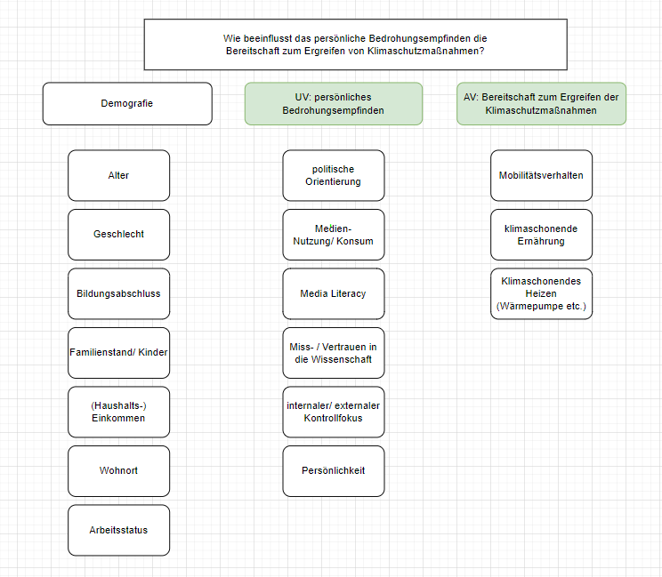

# Verhaltensänderung beim Klimawandel

## Teammitglieder

-   LC
-   SP
-   ZNB

# Forschungsfrage

Wie beeinflusst das **persönliche Bedrohungsempfinden** die
**Bereitschaft zum Ergreifen** von Klimaschutzmaßnahmen?

## Scopus-Recherche

Abstract-Info

## Faktorenraum

<figure>

<figcaption aria-hidden="true">Faktorenraum</figcaption>
</figure>

## Operationalisieren des Fragebogens/ der Items

### Demografie

-   **Alter** nominaler Wert: Einfachantwort
-   **Geschlecht** nominaler Wert: Auswahlmöglichkeit *m/w/d*
-   **Bildungsabschluss** nominaler Wert: Auswahlmöglichkeit *Haupt-
    oder Realschulabschluss/ Ausbildung/ Meister/ (Fach-)Abitur/
    Hochschulabschluss*
-   **Familienstand/ Kinder** nominaler Wert: Mehrfachauswahl *ledig/
    verheiratet/ 1 Kind/ 2 Kinder/ 3 Kinder/ mehr als 3 Kinder/
    geschieden* Begründung: durchschn. Kinder 1,5, also 3 max. Als
    deutscher durchschnitt vgl. Statistisches Bundesamt
-   **Einkommen/Haushaltseinkommen** intervall Wert: Mehrfachauswahl
    *&lt; 1000€, 1000-2000 €, 2000-3000€, 3000-4000€, 4000-5000€, &gt;
    5000€*
-   **Wohnort** nominaler Wert: Mehrfachauswahl *Stadt/ Vorort/ Land*
-   **Arbeitsstatus** nominaler Wert: Mehrfachauswahl *arbeitssuchend/
    Arbeitnehmer/ Arbeitgeber/ selbstständig*

### Persönliches Bedrohungsempfinden: (latentes Merkmal/ Variable)

-   **Politische Orientierung** nominaler Wert: Item bestehend aus
    Rating/ Likert-Skala \[5-stufig\] *Zustimmung/ Ablehnung von
    politischen Statements* Bsp.: “Reiche sollten mehr besteuert werden”
-   **Mediennutzung/–Konsum** ordinal: verschiedene Items
    *Item-Medienkonsum* (Häufigkeit) *Rangliste Item-Medienkonsum* -&gt;
    Mehrfachantwort, Likert-Skala (mehrfach die Woche, einmal …)
    *Klimainhalte-Konsum* (Was wird genutzt?) Mehrfachantwort,
    Likert-Skala mit Statements Bsp.: “Ich konsumiere Inhalte zum Thema
    Klimawandel/ -Schutz”
-   **Media Literacy** Ordinal: Mehrfachantwort, Likert-Skala Statements
    -&gt; orientiert an
    (<https://repositorio.ual.pt/bitstream/11144/3873/1/%5BCommunications%5D%20Measuring%20media%20and%20information%20literacy%20skills%20Construction%20of%20a%20test.pdf>)
    \[diesem Messinstrument/ Text\]
-   **Miss-/ Vertrauen in die Wissenschaft** ordinal: *Item mit
    5-stufiger Likert-Skala* orientiert an
    (<https://www.wissenschaft-im-dialog.de/fileadmin/user_upload/Projekte/Wissenschaftsbarometer/Dokumente_22/Fragebogen_Wissenschaftsbarometer2022_CATI.pdf>)
    \[diesem Messinstrument/ Text\]
-   **Internaler/externaler Kontrollfokus** ordinaler Wert: *Kurzskala
    nach Kovaleva et al 2012*
    (<https://www.gesis.org/fileadmin/kurzskalen/working_papers/IE4_Workingpaper.pdf>)
    \[siehe Hier\]
-   **Persönlichkeit** Item orientiert am Big 5 Test der Uni Leipzig
    (<https://leipzig-bfi2-60.formr.org/>) \[siehe Hier\] oder
    (<https://zis.gesis.org/skala/Danner-Rammstedt-Bluemke-Lechner-Berres-Knopf-Soto-John-Die-deutsche-Version-des-Big-Five-Inventory-2-BFI-2>)
    \[siehe Hier\]

### Bereitschaft zum Ergreifen von Klimaschutzmaßnahmen:

-   **Mobilitätsverhalten** *verschiedene Items* Ranking bevorzugtes
    Verkehrsmittel, Mehrfachantwort Häufigkeit Nutzung, Zustimmung
    Statement Likert Skala Bsp.: “Ich versuche selten das Auto zu nutzen
    wegen dem Klima”
-   **Klimaschonende Ernährung** *verschiedene Items* nominal:
    Mehrfachantwort (vegan/ vegetraisch/ pesketarisch/ ich esse alles/
    weiteres) Mehrfachantwort, Statements Likert Skala (Herkunft,
    Produktion, Siegel, Haltungsart)
-   **Abfall- und Recyclingverhalten** *verschiedene Items* Statements,
    Likert-skala, (Themen: Second-hand, Müllvermeidung, Plastik,
    Wiederverwendung, Flaschen Recyclen Kleidung (Herkunftsland, Masse,
    Inhalt)
-   **Klimaschonende Ressourcen** *verschiedene Items* nominal:
    Mehrfachantwort “ich heize mit…” (ÖL/ Gaß/ Fernwärme/ gar nicht/
    Erdwärme/ Ofen-Kamin/ Paletts) ordinal: Mehrfachantwort Beweggründe
    (kostentechnisch/ Klima/ Verfügbarkeit/ weiteres) ordinal:
    Statements Likert-Skala zur Wassernutzung
-   **Soziales Anerkennungsbedürfnis (Erwünschtheitseffekt)**
    *Mehrfachantwort, Likert-skala*
    (<https://zis.gesis.org/skala/Stock%C3%A9-Bed%C3%BCrfnis-nach-sozialer-Anerkennung>)
    \[siehe Hier\]
-   **Wahrnehmung Klimaschutz** *Likert-Skala zum Klimaschutz*
    (<https://zis.gesis.org/skala/Kals-Becker-Montada-Ittner-Trierer-Skalensystem-zum-Umweltschutz>)
    \[siehe Hier\]
