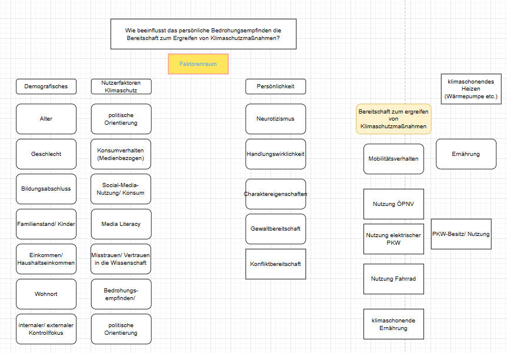

# Verhaltensänderung beim Klimawandel

## Teammitglieder

-   LC
-   SP
-   ZNB

# Forschungsfrage

Wie beeinflusst das **persönliche Bedrohungsempfinden** die
**Bereitschaft zum Ergreifen** von Klimaschutzmaßnahmen?

## Scopus-Recherche

Abstract-Info

## Faktorenraum

<figure>

<figcaption aria-hidden="true">Faktorenraum</figcaption>
</figure>
