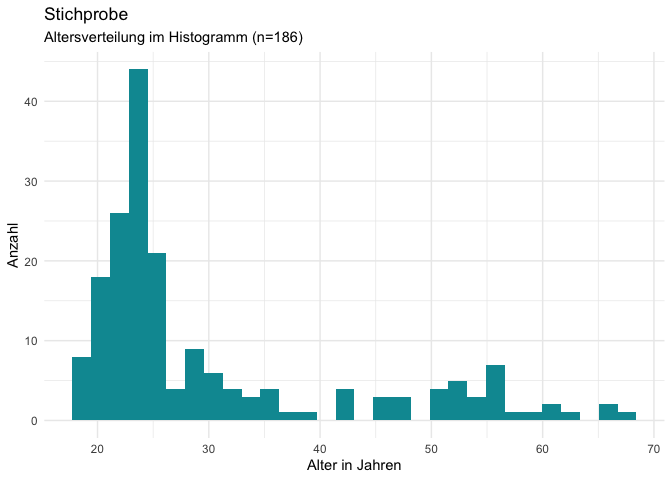
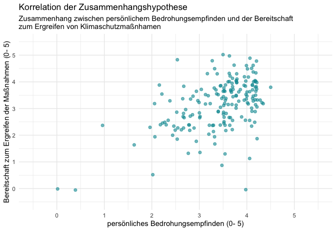
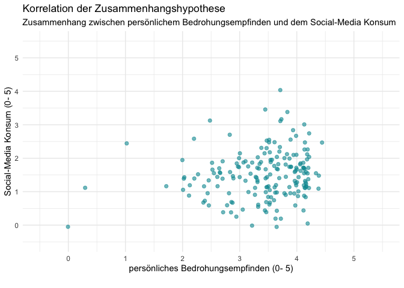
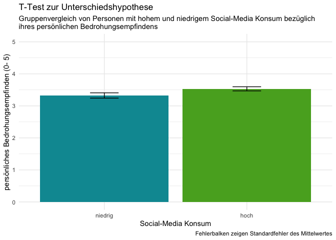
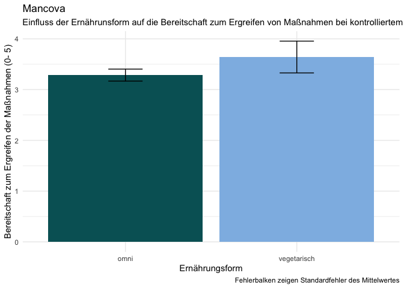

# Verhaltensänderung beim Klimawandel

## Teammitglieder

-   LC
-   SP
-   ZNB
-   JK

# Forschungsfrage

Wie beeinflusst das **persönliche Bedrohungsempfinden** die
**Bereitschaft zum Ergreifen** von Klimaschutzmaßnahmen?

## Scopus-Recherche

Abstract-Info

## Faktorenraum

<figure>

<figcaption aria-hidden="true">Faktorenraum</figcaption>
</figure>

## Operationalisieren des Fragebogens/ der Items

### Demografie

-   **Alter** verhältnisskalierter Wert: Einfachantwort
-   **Geschlecht** nominaler Wert: Auswahlmöglichkeit *m/w/d*
-   **Bildungsabschluss** nominaler Wert: Auswahlmöglichkeit *Haupt-
    oder Realschulabschluss/ Ausbildung/ Meister/ (Fach-)Abitur/
    Hochschulabschluss*
-   **Familienstand/ Kinder** nominaler Wert: Mehrfachauswahl *ledig/
    verheiratet/ 1 Kind/ 2 Kinder/ 3 Kinder/ mehr als 3 Kinder/
    geschieden* Begründung: durchschn. Kinder 1,5, also 3 max. Als
    deutscher durchschnitt vgl. Statistisches Bundesamt
-   **Einkommen/Haushaltseinkommen** intervall Wert: Mehrfachauswahl
    *&lt; 1000€, 1000-2000 €, 2000-3000€, 3000-4000€, 4000-5000€, &gt;
    5000€*
-   **Wohnort** nominaler Wert: Mehrfachauswahl *Stadt/ Vorort/ Land*
-   **Arbeitsstatus** nominaler Wert: Mehrfachauswahl *arbeitssuchend/
    Arbeitnehmer/ Arbeitgeber/ selbstständig*

### Persönliches Bedrohungsempfinden: (latentes Merkmal/ Variable)

-   **Politische Orientierung** nominaler Wert: Item bestehend aus
    Rating/ Likert-Skala \[5-stufig\] *Zustimmung/ Ablehnung von
    politischen Statements* Bsp.: “Reiche sollten mehr besteuert werden”
-   **Mediennutzung/–Konsum** ordinal: verschiedene Items
    *Item-Medienkonsum* (Häufigkeit) *Rangliste Item-Medienkonsum* -&gt;
    Mehrfachantwort, Likert-Skala (mehrfach die Woche, einmal …)
    *Klimainhalte-Konsum* (Was wird genutzt?) Mehrfachantwort,
    Likert-Skala mit Statements Bsp.: “Ich konsumiere Inhalte zum Thema
    Klimawandel/ -Schutz”
-   **Media Literacy** Ordinal: Mehrfachantwort, Likert-Skala Statements
    -&gt; orientiert an [diesem Messinstrument/
    Text](https://repositorio.ual.pt/bitstream/11144/3873/1/%5BCommunications%5D%20Measuring%20media%20and%20information%20literacy%20skills%20Construction%20of%20a%20test.pdf)
-   **Miss-/ Vertrauen in die Wissenschaft** ordinal: *Item mit
    5-stufiger Likert-Skala* orientiert an [diesem Messinstrument/
    Text](https://www.wissenschaft-im-dialog.de/fileadmin/user_upload/Projekte/Wissenschaftsbarometer/Dokumente_22/Fragebogen_Wissenschaftsbarometer2022_CATI.pdf)
-   **Internaler/externaler Kontrollfokus** ordinaler Wert: *Kurzskala
    nach Kovaleva et al. 2012* [siehe
    Hier](https://www.gesis.org/fileadmin/kurzskalen/working_papers/IE4_Workingpaper.pdf)
-   **Persönlichkeit** Item orientiert am Big 5 Test der [Uni
    Leipzig](https://leipzig-bfi2-60.formr.org/) oder [siehe
    Hier](https://zis.gesis.org/skala/Danner-Rammstedt-Bluemke-Lechner-Berres-Knopf-Soto-John-Die-deutsche-Version-des-Big-Five-Inventory-2-BFI-2)

### Bereitschaft zum Ergreifen von Klimaschutzmaßnahmen:

-   **Mobilitätsverhalten** *verschiedene Items* Ranking bevorzugtes
    Verkehrsmittel, Mehrfachantwort Häufigkeit Nutzung, Zustimmung
    Statement Likert Skala Bsp.: “Ich versuche selten das Auto zu nutzen
    wegen dem Klima”
-   **Klimaschonende Ernährung** *verschiedene Items* nominal:
    Mehrfachantwort (vegan/ vegetraisch/ pesketarisch/ ich esse alles/
    weiteres) Mehrfachantwort, Statements Likert Skala (Herkunft,
    Produktion, Siegel, Haltungsart)
-   **Abfall- und Recyclingverhalten** *verschiedene Items* Statements,
    Likert-skala, (Themen: Second-hand, Müllvermeidung, Plastik,
    Wiederverwendung, Flaschen Recyclen Kleidung (Herkunftsland, Masse,
    Inhalt)
-   **Klimaschonende Ressourcen** *verschiedene Items* nominal:
    Mehrfachantwort “ich heize mit…” (ÖL/ Gas/ Fernwärme/ gar nicht/
    Erdwärme/ Ofen-Kamin/ Paletts) ordinal: Mehrfachantwort Beweggründe
    (kostentechnisch/ Klima/ Verfügbarkeit/ weiteres) ordinal:
    Statements Likert-Skala zur Wassernutzung
-   **Soziales Anerkennungsbedürfnis (Erwünschtheitseffekt)**
    *Mehrfachantwort, Likert-skala* [siehe
    Hier](https://zis.gesis.org/skala/Stock%C3%A9-Bed%C3%BCrfnis-nach-sozialer-Anerkennung)
-   **Wahrnehmung Klimaschutz** *Likert-Skala zum Klimaschutz* [siehe
    Hier](https://zis.gesis.org/skala/Kals-Becker-Montada-Ittner-Trierer-Skalensystem-zum-Umweltschutz)
-   **Bereitschaft zum Handeln** *Item nach Montada et al. 1999* [siehe
    Hier](https://zis.gesis.org/skala/Montada-Kals-Becker-Umweltsch%C3%BCtzende-und-gef%C3%A4hrdende-Engagementbereitschaften)

### Altersverteilung der Stichprobe im Histogramm

    ##     alpha mean   sd median min max
    ## SMK  0.37 2.51 0.71   2.43   1 5.0
    ## PO   0.88 4.40 1.08   4.50   1 6.0
    ## PBE  0.68 4.43 0.72   4.50   1 5.5
    ## BEK  0.81 4.16 0.94   4.33   1 6.0

## Hypothesen

-   **Zusammenhangshypothesen**

-   “Es gibt einen Zusammenhang zwischen dem persönlichen
    Bedrohungsempfinden und der Bereitschaft zum Ergreifen von
    Klimaschutzmaßnahmen. (ungerichtete Korrelation)”

<!-- -->

    ## 
    ##  Pearson's product-moment correlation
    ## 
    ## data:  df$PBE and df$BEK
    ## t = 7.7735, df = 184, p-value = 5.237e-13
    ## alternative hypothesis: true correlation is not equal to 0
    ## 95 percent confidence interval:
    ##  0.3805558 0.5982895
    ## sample estimates:
    ##       cor 
    ## 0.4972108

-   “Je häufiger Social-Media konsumiert wird, desto höher ist das
    persönliche Bedrohungsempfinden bezüglich des Klimawandels.”

<!-- -->

    ## 
    ##  Pearson's product-moment correlation
    ## 
    ## data:  df$SMK and df$PBE
    ## t = 2.0245, df = 184, p-value = 0.04436
    ## alternative hypothesis: true correlation is not equal to 0
    ## 95 percent confidence interval:
    ##  0.003816071 0.285431561
    ## sample estimates:
    ##       cor 
    ## 0.1476144

-   “Die Bereitschaft zum Ergreifen von Klimaschutzmaßnahmen ist
    abhängig von der Sympathie für politische Parteien.”

<!-- -->

    ## 
    ##  LINEAR REGRESSION
    ## 
    ##  Model Fit Measures                                                                         
    ##  ────────────────────────────────────────────────────────────────────────────────────────── 
    ##    Model    R            R²            Adjusted R²    F           df1    df2    p           
    ##  ────────────────────────────────────────────────────────────────────────────────────────── 
    ##        1    0.2944549    0.08670369     0.07122410    5.601159      1     59    0.0212498   
    ##        2    0.4133018    0.17081834     0.14222587    5.974242      2     58    0.0043736   
    ##        3    0.4863909    0.23657612     0.19639591    5.887877      3     57    0.0014237   
    ##        4    0.5220470    0.27253309     0.22057117    5.244862      4     56    0.0011663   
    ##        5    0.5346894    0.28589278     0.22097394    4.403849      5     55    0.0019177   
    ##        6    0.5373165    0.28870907     0.20967674    3.653050      6     54    0.0040795   
    ##        7    0.5427868    0.29461753     0.20145381    3.162363      7     53    0.0072052   
    ##        8    0.5440967    0.29604126     0.18773991    2.733496      8     52    0.0135282   
    ##  ────────────────────────────────────────────────────────────────────────────────────────── 
    ## 
    ## 
    ##  Model Comparisons                                                              
    ##  ────────────────────────────────────────────────────────────────────────────── 
    ##    Model         Model    ΔR²            F            df1    df2    p           
    ##  ────────────────────────────────────────────────────────────────────────────── 
    ##        1    -        2    0.084114643    5.8836917      1     58    0.0184142   
    ##        2    -        3    0.065757779    4.9097146      1     57    0.0307149   
    ##        3    -        4    0.035956977    2.7679482      1     56    0.1017563   
    ##        4    -        5    0.013359686    1.0289530      1     55    0.3148464   
    ##        5    -        6    0.002816287    0.2138077      1     54    0.6456570   
    ##        6    -        7    0.005908466    0.4439417      1     53    0.5081161   
    ##        7    -        8    0.001423725    0.1051676      1     52    0.7470152   
    ##  ────────────────────────────────────────────────────────────────────────────── 
    ## 
    ## 
    ##  MODEL SPECIFIC RESULTS
    ## 
    ##  MODEL 1
    ## 
    ##  Model Coefficients - BEK                                                                   
    ##  ────────────────────────────────────────────────────────────────────────────────────────── 
    ##    Predictor         Estimate     SE           t            p             Stand. Estimate   
    ##  ────────────────────────────────────────────────────────────────────────────────────────── 
    ##    Intercept         3.5357851    0.2351311    15.037505    < .0000001                      
    ##    orientation1_7    0.3468679    0.1465633     2.366677     0.0212498          0.2944549   
    ##  ────────────────────────────────────────────────────────────────────────────────────────── 
    ## 
    ## 
    ##  MODEL 2
    ## 
    ##  Model Coefficients - BEK                                                                    
    ##  ─────────────────────────────────────────────────────────────────────────────────────────── 
    ##    Predictor         Estimate      SE           t            p             Stand. Estimate   
    ##  ─────────────────────────────────────────────────────────────────────────────────────────── 
    ##    Intercept          4.0061254    0.2977566    13.454363    < .0000001                      
    ##    orientation1_7     0.4790988    0.1510312     3.172183     0.0024193          0.4067052   
    ##    orientation1_5    -0.5623998    0.2318570    -2.425632     0.0184142         -0.3109900   
    ##  ─────────────────────────────────────────────────────────────────────────────────────────── 
    ## 
    ## 
    ##  MODEL 3
    ## 
    ##  Model Coefficients - BEK                                                                     
    ##  ──────────────────────────────────────────────────────────────────────────────────────────── 
    ##    Predictor         Estimate      SE            t            p             Stand. Estimate   
    ##  ──────────────────────────────────────────────────────────────────────────────────────────── 
    ##    Intercept          3.5887426    0.34429988    10.423305    < .0000001                      
    ##    orientation1_7     0.4036186    0.15010103     2.688980     0.0093822          0.3426304   
    ##    orientation1_5    -0.5254610    0.22503484    -2.335020     0.0230870         -0.2905640   
    ##    orientation1_3     0.1805772    0.08149573     2.215788     0.0307149          0.2633169   
    ##  ──────────────────────────────────────────────────────────────────────────────────────────── 
    ## 
    ## 
    ##  MODEL 4
    ## 
    ##  Model Coefficients - BEK                                                                     
    ##  ──────────────────────────────────────────────────────────────────────────────────────────── 
    ##    Predictor         Estimate      SE            t            p             Stand. Estimate   
    ##  ──────────────────────────────────────────────────────────────────────────────────────────── 
    ##    Intercept          3.7556568    0.35361218    10.620836    < .0000001                      
    ##    orientation1_7     0.5103031    0.16113487     3.166932     0.0024939          0.4331945   
    ##    orientation1_5    -0.5357191    0.22170982    -2.416307     0.0189638         -0.2962364   
    ##    orientation1_3     0.2502752    0.09053603     2.764371     0.0077066          0.3649502   
    ##    orientation1_1    -0.2041965    0.12273525    -1.663715     0.1017563         -0.2410430   
    ##  ──────────────────────────────────────────────────────────────────────────────────────────── 
    ## 
    ## 
    ##  MODEL 5
    ## 
    ##  Model Coefficients - BEK                                                                    
    ##  ─────────────────────────────────────────────────────────────────────────────────────────── 
    ##    Predictor         Estimate      SE           t            p             Stand. Estimate   
    ##  ─────────────────────────────────────────────────────────────────────────────────────────── 
    ##    Intercept          3.7500982    0.3535633    10.606583    < .0000001                      
    ##    orientation1_7     0.4961130    0.1616995     3.068118     0.0033401          0.4211485   
    ##    orientation1_5    -0.5926900    0.2286574    -2.592044     0.0121961         -0.3277396   
    ##    orientation1_3     0.2032319    0.1017022     1.998304     0.0506372          0.2963518   
    ##    orientation1_1    -0.2157811    0.1232339    -1.750988     0.0855235         -0.2547179   
    ##    orientation1_6     0.1231614    0.1214162     1.014373     0.3148464          0.1458003   
    ##  ─────────────────────────────────────────────────────────────────────────────────────────── 
    ## 
    ## 
    ##  MODEL 6
    ## 
    ##  Model Coefficients - BEK                                                                      
    ##  ───────────────────────────────────────────────────────────────────────────────────────────── 
    ##    Predictor         Estimate       SE           t             p             Stand. Estimate   
    ##  ───────────────────────────────────────────────────────────────────────────────────────────── 
    ##    Intercept          3.73058376    0.3586097    10.4029086    < .0000001                      
    ##    orientation1_7     0.44816422    0.1930776     2.3211615     0.0240823         0.38044498   
    ##    orientation1_5    -0.60397202    0.2315982    -2.6078441     0.0117579        -0.33397819   
    ##    orientation1_3     0.19830301    0.1029901     1.9254571     0.0594451         0.28916455   
    ##    orientation1_1    -0.21340374    0.1242306    -1.7178030     0.0915626        -0.25191165   
    ##    orientation1_6     0.13203965    0.1237916     1.0666290     0.2908851         0.15631062   
    ##    orientation1_8     0.06186559    0.1337943     0.4623935     0.6456570         0.06715677   
    ##  ───────────────────────────────────────────────────────────────────────────────────────────── 
    ## 
    ## 
    ##  MODEL 7
    ## 
    ##  Model Coefficients - BEK                                                                      
    ##  ───────────────────────────────────────────────────────────────────────────────────────────── 
    ##    Predictor         Estimate       SE           t             p             Stand. Estimate   
    ##  ───────────────────────────────────────────────────────────────────────────────────────────── 
    ##    Intercept          3.84655329    0.4002915     9.6093799    < .0000001                      
    ##    orientation1_7     0.44065590    0.1944063     2.2666752     0.0275165         0.37407119   
    ##    orientation1_5    -0.57023219    0.2382437    -2.3934830     0.0202622        -0.31532109   
    ##    orientation1_3     0.18824907    0.1046184     1.7993877     0.0776513         0.27450395   
    ##    orientation1_1    -0.17146200    0.1398438    -1.2260961     0.2255824        -0.20240168   
    ##    orientation1_6     0.08972428    0.1397039     0.6422461     0.5234819         0.10621702   
    ##    orientation1_8     0.08674021    0.1395740     0.6214638     0.5369585         0.09415884   
    ##    orientation1_2    -0.08383084    0.1258174    -0.6662895     0.5081161        -0.10117412   
    ##  ───────────────────────────────────────────────────────────────────────────────────────────── 
    ## 
    ## 
    ##  MODEL 8
    ## 
    ##  Model Coefficients - BEK                                                                      
    ##  ───────────────────────────────────────────────────────────────────────────────────────────── 
    ##    Predictor         Estimate       SE           t             p             Stand. Estimate   
    ##  ───────────────────────────────────────────────────────────────────────────────────────────── 
    ##    Intercept          3.85643216    0.4048618     9.5253059    < .0000001                      
    ##    orientation1_7     0.45276930    0.1995948     2.2684418     0.0274819         0.38435421   
    ##    orientation1_5    -0.57366818    0.2405142    -2.3851738     0.0207505        -0.31722108   
    ##    orientation1_3     0.19190750    0.1061143     1.8084984     0.0763128         0.27983865   
    ##    orientation1_1    -0.16989973    0.1411218    -1.2039227     0.2340713        -0.20055751   
    ##    orientation1_6     0.08832609    0.1409644     0.6265846     0.5336728         0.10456181   
    ##    orientation1_8     0.08776943    0.1408032     0.6233483     0.5357804         0.09527609   
    ##    orientation1_2    -0.06778620    0.1361973    -0.4977060     0.6207896        -0.08181009   
    ##    orientation1_4    -0.03433315    0.1058699    -0.3242956     0.7470152        -0.04549115   
    ##  ─────────────────────────────────────────────────────────────────────────────────────────────

-   **Regression**

-   “Hoher Social-Media-Konsum und ein hohes persönliches
    Bedrohungsempfinden sorgen für eine erhöhte Bereitschaft zum
    Ergreifen von Klimaschutzmaßnahmen.”

<!-- -->

    ## 
    ##  LINEAR REGRESSION
    ## 
    ##  Model Fit Measures                                                                         
    ##  ────────────────────────────────────────────────────────────────────────────────────────── 
    ##    Model    R            R²           Adjusted R²    F           df1    df2    p            
    ##  ────────────────────────────────────────────────────────────────────────────────────────── 
    ##        1    0.4972108    0.2472186      0.2431274    60.42687      1    184    < .0000001   
    ##        2    0.4979539    0.2479581      0.2397390    30.16875      2    183    < .0000001   
    ##  ────────────────────────────────────────────────────────────────────────────────────────── 
    ## 
    ## 
    ##  Model Comparisons                                                              
    ##  ────────────────────────────────────────────────────────────────────────────── 
    ##    Model         Model    ΔR²            F            df1    df2    p           
    ##  ────────────────────────────────────────────────────────────────────────────── 
    ##        1    -        2    7.394856e-4    0.1799446      1    183    0.6719191   
    ##  ────────────────────────────────────────────────────────────────────────────── 
    ## 
    ## 
    ##  MODEL SPECIFIC RESULTS
    ## 
    ##  MODEL 1
    ## 
    ##  Model Coefficients - BEK                                                              
    ##  ───────────────────────────────────────────────────────────────────────────────────── 
    ##    Predictor    Estimate     SE            t           p             Stand. Estimate   
    ##  ───────────────────────────────────────────────────────────────────────────────────── 
    ##    Intercept    1.3018741    0.37232551    3.496602     0.0005906                      
    ##    PBE          0.6452355    0.08300480    7.773472    < .0000001          0.4972108   
    ##  ───────────────────────────────────────────────────────────────────────────────────── 
    ## 
    ## 
    ##  MODEL 2
    ## 
    ##  Model Coefficients - BEK                                                                
    ##  ─────────────────────────────────────────────────────────────────────────────────────── 
    ##    Predictor    Estimate      SE            t            p             Stand. Estimate   
    ##  ─────────────────────────────────────────────────────────────────────────────────────── 
    ##    Intercept    1.23364412    0.40634691    3.0359382     0.0027477                      
    ##    PBE          0.63996857    0.08411183    7.6085439    < .0000001         0.49315221   
    ##    SMK          0.03652973    0.08611467    0.4241987     0.6719191         0.02749469   
    ##  ───────────────────────────────────────────────────────────────────────────────────────

-   **Unterschiedshypothesen**

-   “Das persönliche Bedrohungsempfinden bezüglich des Klimawandels
    unterscheidet sich bei Personen mit hohem und niedrigem
    Social-Media-Konsum. (unverbundener T-Test)”

<!-- -->

    ## 
    ##  Welch Two Sample t-test
    ## 
    ## data:  filter(df, df$konsumgroup == "hoch")$PBE and filter(df, df$konsumgroup == "niedrig")$PBE
    ## t = -1.9867, df = 174.33, p-value = 0.04852
    ## alternative hypothesis: true difference in means is not equal to 0
    ## 95 percent confidence interval:
    ##  -0.414915092 -0.001366129
    ## sample estimates:
    ## mean of x mean of y 
    ##  4.324468  4.532609

-   “Die Bereitschaft zum Ergreifen von Klimaschutzmaßnahmen
    unterscheidet sich bei Personen mit veganem Ernährungsverhalten im
    Gegensatz zu Personen mit uneingeschränktem Ernährungsverhalten.”

# Unverbundener T-Test:

    ## 
    ##  Welch Two Sample t-test
    ## 
    ## data:  filter(df, df$ef == "vegan")$BEK and filter(df, df$ef == "omni")$BEK
    ## t = 5.0855, df = 6.0937, p-value = 0.002153
    ## alternative hypothesis: true difference in means is not equal to 0
    ## 95 percent confidence interval:
    ##  0.6493716 1.8451511
    ## sample estimates:
    ## mean of x mean of y 
    ##  5.194444  3.947183

-   “Das persönliche Bedrohungsempfinden bezüglich des Klimawandels
    unterscheidet sich bei Personen mit linker politischer Orientierung
    und bei Personen mit rechter politischer Orientierung.”

<!-- -->

    ## 
    ##  Welch Two Sample t-test
    ## 
    ## data:  filter(df, df$linksrechts == "links")$PBE and filter(df, df$linksrechts == "rechts")$PBE
    ## t = 3.2286, df = 44.342, p-value = 0.002344
    ## alternative hypothesis: true difference in means is not equal to 0
    ## 95 percent confidence interval:
    ##  0.1801432 0.7783120
    ## sample estimates:
    ## mean of x mean of y 
    ##  4.583990  4.104762

-   **MANCOVA**

-   “Wohnort und Ernährungsform haben bei kontrolliertem Alterseinfluss
    einen Einfluss auf das persönliche Bedrohungsempfinden und auf die
    Bereitschaft zum Ergreifen von Klimaschutzmaßnahmen.”

<!-- -->

    ## 
    ##  MANCOVA
    ## 
    ##  Multivariate Tests                                                                        
    ##  ───────────────────────────────────────────────────────────────────────────────────────── 
    ##                                      value         F             df1    df2    p           
    ##  ───────────────────────────────────────────────────────────────────────────────────────── 
    ##    urban       Pillai's Trace        0.15594462     7.2726869      4    344    0.0000124   
    ##                Wilks' Lambda          0.8440620     7.5634034      4    342    0.0000076   
    ##                Hotelling's Trace     0.18473915     7.8514140      4    340    0.0000046   
    ##                Roy's Largest Root    0.18469644    15.8838940      2    172    0.0000005   
    ##                                                                                            
    ##    ef          Pillai's Trace        0.10807742    10.3603378      2    171    0.0000566   
    ##                Wilks' Lambda          0.8919226    10.3603378      2    171    0.0000566   
    ##                Hotelling's Trace     0.12117354    10.3603378      2    171    0.0000566   
    ##                Roy's Largest Root    0.12117354    10.3603378      2    171    0.0000566   
    ##                                                                                            
    ##    urban:ef    Pillai's Trace        0.01501922     0.6507131      4    344    0.6267209   
    ##                Wilks' Lambda          0.9850237     0.6475210      4    342    0.6289761   
    ##                Hotelling's Trace     0.01516052     0.6443220      4    340    0.6312395   
    ##                Roy's Largest Root    0.01131286     0.9729059      2    172    0.3800533   
    ##                                                                                            
    ##    age         Pillai's Trace        0.03262230     2.8832652      2    171    0.0586765   
    ##                Wilks' Lambda          0.9673777     2.8832652      2    171    0.0586765   
    ##                Hotelling's Trace     0.03372240     2.8832652      2    171    0.0586765   
    ##                Roy's Largest Root    0.03372240     2.8832652      2    171    0.0586765   
    ##  ───────────────────────────────────────────────────────────────────────────────────────── 
    ## 
    ## 
    ##  Univariate Tests                                                                                       
    ##  ────────────────────────────────────────────────────────────────────────────────────────────────────── 
    ##                 Dependent Variable    Sum of Squares    df     Mean Square    F             p           
    ##  ────────────────────────────────────────────────────────────────────────────────────────────────────── 
    ##    urban        PBE                       10.5185986      2      5.2592993    11.4908005    0.0000207   
    ##                 BEK                       15.5077880      2      7.7538940    10.8868732    0.0000353   
    ##    ef           PBE                        4.1494763      1      4.1494763     9.0659994    0.0029965   
    ##                 BEK                       13.5577875      1     13.5577875    19.0358435    0.0000221   
    ##    urban:ef     PBE                        0.6807927      2      0.3403964     0.7437163    0.4768664   
    ##                 BEK                        0.5144936      2      0.2572468     0.3611880    0.6973753   
    ##    age          PBE                        0.6700394      1      0.6700394     1.4639381    0.2279648   
    ##                 BEK                        1.4065140      1      1.4065140     1.9748193    0.1617409   
    ##    Residuals    PBE                       78.7237994    172      0.4576965                              
    ##                 BEK                      122.5025541    172      0.7122242                              
    ##  ──────────────────────────────────────────────────────────────────────────────────────────────────────

## Variablennamen/ Legende

-   **VE** (vegane, vegetarische Ernährung), UE (uneingeschränkte
    Ernährung)
-   **LPO** (linke polit. Orientierung), RPO (rechte polit.
    Orientierung)
-   **GN** (Geschlecht), WO (wohnort), MV (Mobilitätsverhalten)
-   **PBE** (persönliches Bedrohungsempfinden), BEK (Bereitschaft zum
    Ergreifen von Klimaschutzmaßnahmen), hBEK (hohe …)
-   **Age** (Alter)
-   **SMK** (Social-Media-Konsum), hSMK (hoher …)
-   **SPP** (Sympathie polit. Parteien)
-   **EF** (Ernährungsweise)
